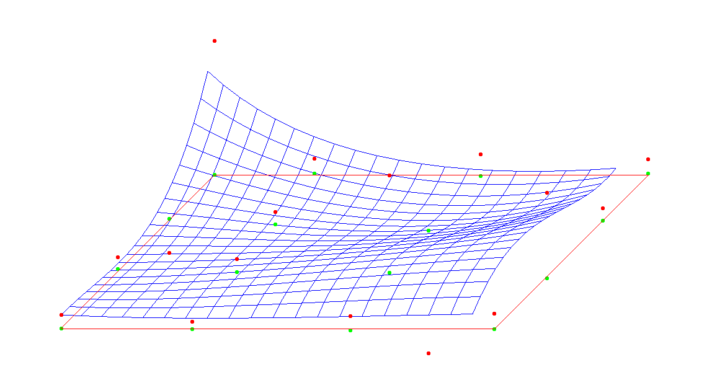

# Bezier surface
Project for Computer Graphics course.

### Summary
This project renders a Bezier surface with at least 16 controlpoints.  
All controlpoints can be moved around and the surface dynamically changes.

You will need GLFW to compile this project:  
[GLFW download page](http://www.glfw.org/download.html)

And here is a screenshot of it working:

### Usage
You have to place 16 controlpoints, which are initially will be placed on the X-Z plain.  
After placing a point down, you can set it's Y coordinate by draging it up or down. Also a point's X and Z coordinates also can be modified by grabbing the green-colored point, which will affect the "real" (red-colored) point, too.
